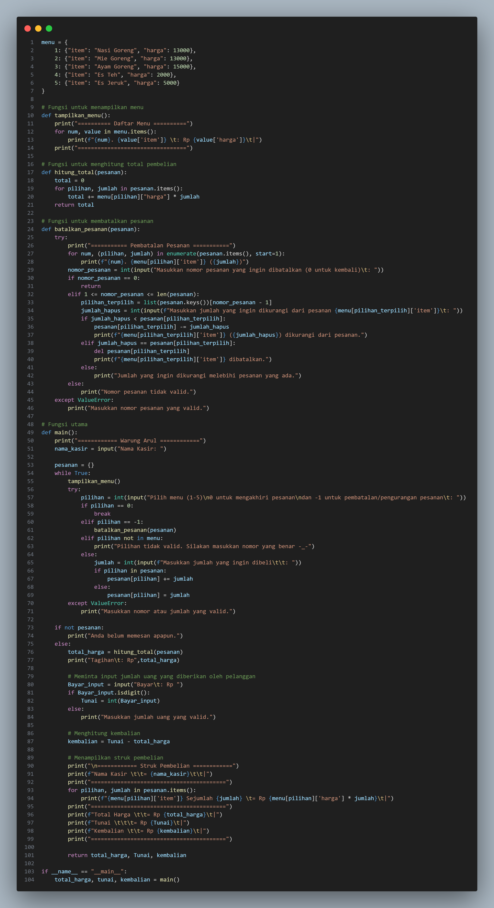
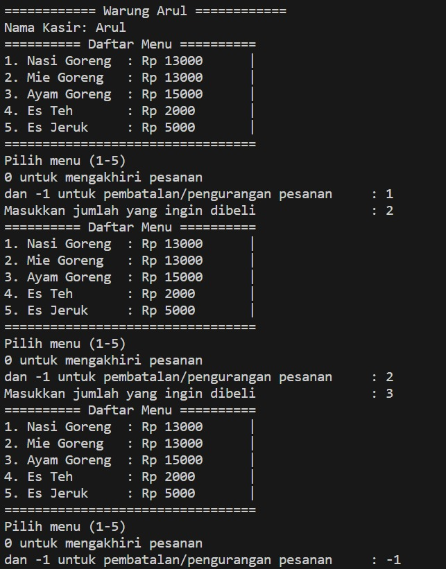
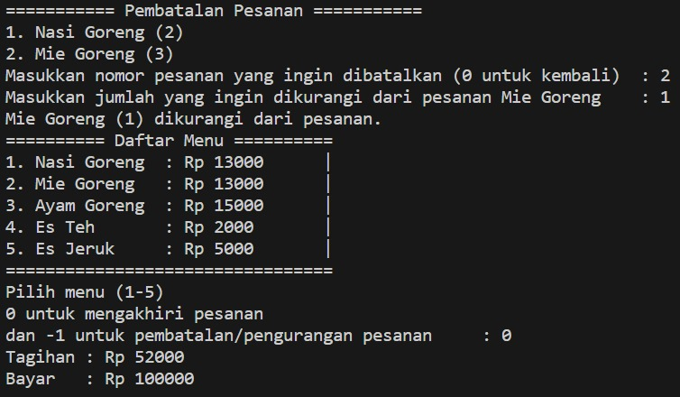
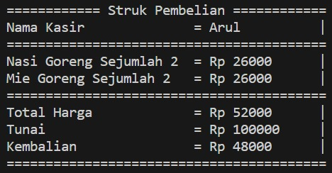

# Profil

| NAMA  :| Muhammad Nurul Firdaus |
| --- | --- |
| NIM   :| 312310495 |
| KELAS :| TI.23.A.5 |
| DOSEN :| Agung Nugroho,S.Kom.,M.Kom |
| LINK YOUTUBE |  https://youtu.be/fSteUyF_6ok                   |

# Project UAS
## Membuat Program Kasir Sederhana Menggunakan Bahasa Pemrograman Python

## Buatlah program kasir di sebuah kantin, dengan kondisi berikut:
* List opsi pilihan makanan/minuman dan aksi, bisa menggunakan format dictionary
* Program harus meminta input pilihan makanan dari pengguna.
* Program harus menghitung total harga makanan yang dipesan.
* Program harus menampilkan struk pembelian.

## Programnya: 


# Penjelasan fungsi-fungsi kode tersebut

* Berfungsi sebagai Dictionary dan memiliki variabel yaitu "menu" dan isinya bisa dirubah sesuai dengan keinginan pengguna, apakah ingin menambah jumlah menu, mengganti menu ataupun mengganti harga menu dan harus menggunakan tanda koma (,) diakhir agar tidak terjadi error, menu terakhir tidak perlu menggunakan tanda koma (,).
``````python
menu = {
    1: {"item": "Nasi Goreng", "harga": 13000}, 
    2: {"item": "Mie Goreng", "harga": 13000},
    3: {"item": "Ayam Goreng", "harga": 15000},
    4: {"item": "Es Teh", "harga": 2000},
    5: {"item": "Es Jeruk", "harga": 5000}
}
``````

* Berfungsi untuk menampilkan menu yang disajikan
``````python
def tampilkan_menu():
    print("========== Daftar Menu ==========") # Berfungsi sebagai nama toko (boleh diubah)
    for num, value in menu.items(): # Menggunakan loop for, kode ini akan mengiterasi melalui setiap pasangan kunci dan nilai di dalam dictionary menu.
        print(f"{num}. {value['item']} \t: Rp {value['harga']}\t|") # Ini mencetak setiap item menu bersama dengan nomor urut, nama item, dan harga. Format string yang digunakan disebut f-string, dan digunakan untuk memasukkan nilai variabel ke dalam string.
    print("=================================")
``````

* Mendefinisikan fungsi hitung_total(pesanan) yang bertujuan untuk menghitung total biaya pesanan berdasarkan daftar pesanan yang diberikan
``````python
def hitung_total(pesanan):
    total = 0
    for pilihan, jumlah in pesanan.items():
        total += menu[pilihan]["harga"] * jumlah # Akan mengalikan harga pesanan dengan jumlah pesanan
    return total # Mengembalikan nilai 
``````

* Implementasi dari fungsi batalkan_pesanan dalam bahasa pemrograman Python. Fungsi ini menerima satu parameter, yaitu pesanan, yang seharusnya merupakan sebuah kamus (dictionary) yang berisi pesanan makanan atau minuman.

``````python
def batalkan_pesanan(pesanan):
    try:
        print("=========== Pembatalan Pesanan ===========")
        # Menampilkan pesanan yang ada menggunakan enumerate
        for num, (pilihan, jumlah) in enumerate(pesanan.items(), start=1):
            print(f"{num}. {menu[pilihan]['item']} ({jumlah})")
        
        # Meminta input nomor pesanan yang ingin dibatalkan
        nomor_pesanan = int(input("Masukkan nomor pesanan yang ingin dibatalkan (0 untuk kembali)\t: "))
        
        # Jika nomor_pesanan = 0, keluar dari fungsi
        if nomor_pesanan == 0:
            return
        # Jika nomor pesanan valid
        elif 1 <= nomor_pesanan <= len(pesanan):
            # Mendapatkan pilihan_terpilih berdasarkan nomor_pesanan
            pilihan_terpilih = list(pesanan.keys())[nomor_pesanan - 1]
            # Meminta input jumlah yang ingin dikurangi dari pesanan
            jumlah_hapus = int(input(f"Masukkan jumlah yang ingin dikurangi dari pesanan {menu[pilihan_terpilih]['item']}\t: "))
            # Jika jumlah_hapus kurang dari pesanan[pilihan_terpilih], kurangi jumlah pesanan
            if jumlah_hapus < pesanan[pilihan_terpilih]:
                pesanan[pilihan_terpilih] -= jumlah_hapus
                print(f"{menu[pilihan_terpilih]['item']} ({jumlah_hapus}) dikurangi dari pesanan.")
            # Jika jumlah_hapus sama dengan pesanan[pilihan_terpilih], hapus pesanan tersebut
            elif jumlah_hapus == pesanan[pilihan_terpilih]:
                del pesanan[pilihan_terpilih]
                print(f"{menu[pilihan_terpilih]['item']} dibatalkan.")
            # Jika jumlah_hapus melebihi pesanan[pilihan_terpilih], tampilkan pesan kesalahan
            else:
                print("Jumlah yang ingin dikurangi melebihi pesanan yang ada.")
        # Jika nomor_pesanan tidak valid
        else:
            print("Nomor pesanan tidak valid.")
    # Mengatasi ValueError jika input bukan angka
    except ValueError:
        print("Masukkan nomor pesanan yang valid.")
``````

* Implementasi dari fungsi main dalam bahasa pemrograman Python. Fungsi ini bertanggung jawab untuk menjalankan program warung makan sederhana
``````python
def main():
    print("============ Warung Arul ============")
    
    # Meminta input nama kasir
    nama_kasir = input("Nama Kasir: ")
    
    # Inisialisasi pesanan sebagai dictionary
    pesanan = {}

    # Loop Utama Program
    while True:

        # Menampilkan menu menggunakan funngsi tampilkan_menu()
        tampilkan_menu()
        try:
            # Meminta input pilihan menu dari pengguna
            pilihan = int(input("Pilih menu (1-5)\n0 untuk mengakhiri pesanan\ndan -1 untuk pembatalan/pengurangan pesanan\t: "))

            # Keluar dari loop jika pilihan = 0
            if pilihan == 0:
                break
            
            # Memanggil fungsi batalkan_pesanan jika pilihan = -1
            elif pilihan == -1:
                batalkan_pesanan(pesanan)
            
            # Menampilkan pesan kesalahan jika pilihan tidak valid
            elif pilihan not in menu:
                print("Pilihan tidak valid. Silakan masukkan nomor yang benar -_-")
            else:
                # Meminta input jumlah pesanan
                jumlah = int(input(f"Masukkan jumlah yang ingin dibeli\t\t: "))
                
                # Menambah pesanan ke dictionary pesanan
                if pilihan in pesanan:
                    pesanan[pilihan] += jumlah
                else:
                    pesanan[pilihan] = jumlah
        # Menangani ValueError jika input bukan angka
        except ValueError:
            print("Masukkan nomor atau jumlah yang valid.")

    # Menampilkan Jika Pesanan Kosong
    if not pesanan:
        print("Anda belum memesan apapun.")
    else:
        # Menghitung total harga pesanan dan menampilkannya
        total_harga = hitung_total(pesanan)
        print("Tagihan\t: Rp",total_harga)
``````

* Berfungsi untuk meminta input jumlah uang yang diberikan oleh pelanggan
``````python
# Meminta input jumlah uang yang diberikan oleh pelanggan
        Bayar_input = input("Bayar\t: Rp ")
        
        # Jika benar, mengonversi input ke dalam tipe data integer dan menyimpannya dalam variabel Tunai
        if Bayar_input.isdigit():
            Tunai = int(Bayar_input)
        else:
            # Jika input tidak hanya terdiri dari digit, mencetak pesan kesalahan
            print("Masukkan jumlah uang yang valid.")
``````

* Berfungsi untuk menghitung total kembalian
``````python
# Menghitung kembalian 
        kembalian = Tunai - total_harga
``````

* Berfungsi Untuk memunculkan struk pembelian
``````python
print("\n============ Struk Pembelian ============")
        # Mencetak nama kasir yang sebelumnya diinput oleh pengguna
        print(f"Nama Kasir \t\t= {nama_kasir}\t\t|")
        print("=========================================")
        # 'pesanan.items()' untuk mencetak setiap item pesanan dan jumlahnya
        for pilihan, jumlah in pesanan.items():
            # Nama item dan harga pesanan yang diambil dari dictionary menu dikalikan dengan jumlah pesanan yang dibuat
            print(f"{menu[pilihan]['item']} Sejumlah {jumlah} \t= Rp {menu[pilihan]['harga'] * jumlah}\t|")
        print("=========================================")
        # Mencetak total harga dari seluruh pesanan
        print(f"Total Harga \t\t= Rp {total_harga}\t|")
        # Mencetak jumlah uang yang dibayarkan oleh pelanggan
        print(f"Tunai \t\t\t= Rp {Tunai}\t|")
        # Mencetak jumlah kembalian yang diberikan kepada pelanggan
        print(f"Kembalian \t\t= Rp {kembalian}\t|")
        print("=========================================")

        # Mengembalikan nilai total_harga, Tunai, dan kembalian dari fungsi main()
        return total_harga, Tunai, kembalian

# Menjalankan fungsi 'main()' dan menyimpan hasilnya ke dalam variabel 'total_harga', 'tunai', dan 'kembalian' jika script dijalankan sebagai program utama (bukan sebagai modul yang diimpor)
if __name__ == "__main__":
    total_harga, tunai, kembalian = main()
``````

## Output Programnya:


